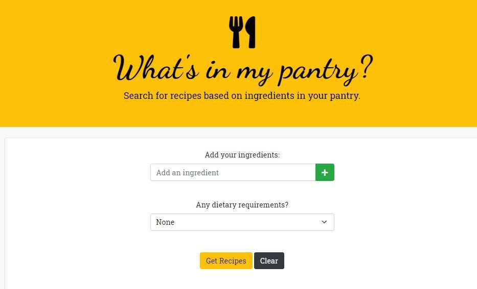
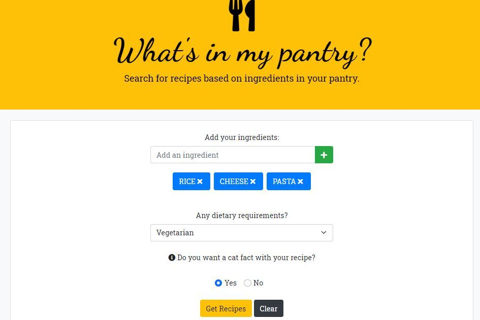
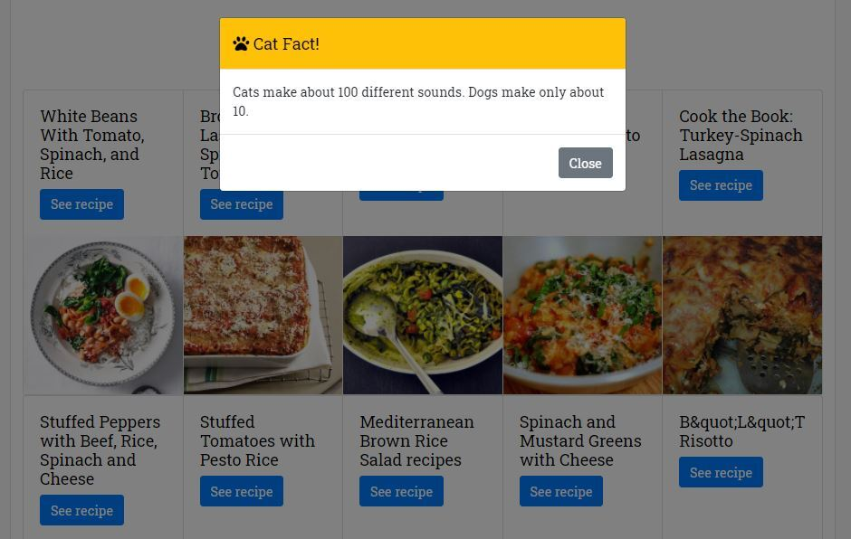
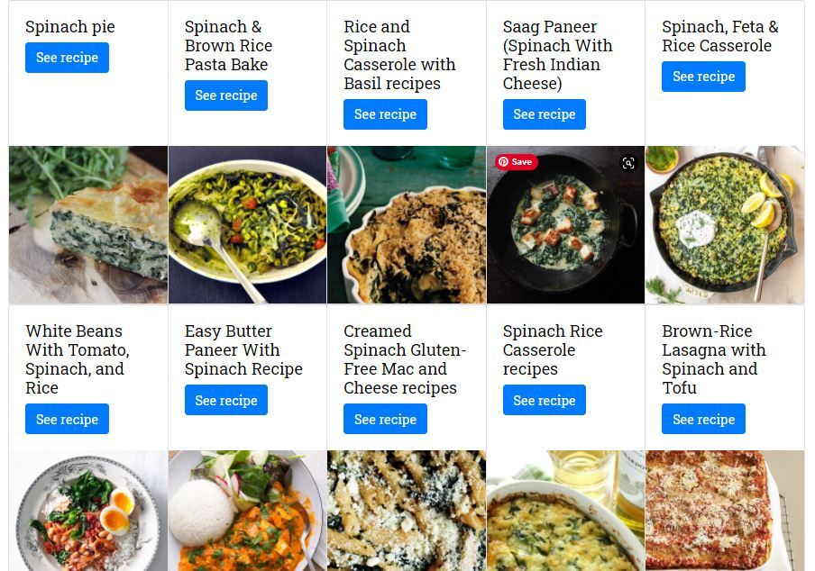
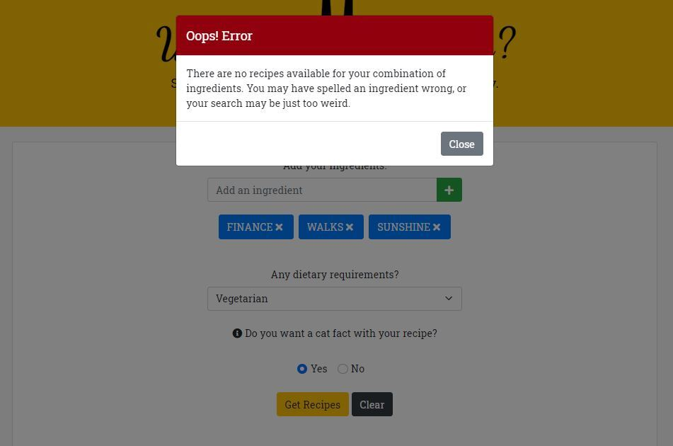

# What's In My Pantry

## URLs

- The URL of the deployed application: <https://mskippen.github.io/whats-in-my-pantry/>
- The URL of the GitHub repository, with a unique name and a README describing the project: <https://github.com/mskippen/whats-in-my-pantry.git>
- The URL of our presentation to assist with your user experience: <https://drive.google.com/file/d/1VgKdZtOiFAXgQNw1Jv1laCC5kMSBO7NC/view?usp=sharing>

## The app functionality

WHAT'S IN MY PANTRY is an easy to use, all-in-one recipe search app that will display recipes based on a list of food items that are currently in your pantry 
THIS APP will allow you to check against a set list of allergies and dietary requirements 
AS A BONUS the app will present you with a fun cat fact to keep you and your guests entertained while cooking 

## Daily problem to solve using a persona example

TRENT is a single parent and wants to make dinner for his kids but is time poor and doesn’t want to go to the shops 
TRENT checks the kitchen cupboards and types what he has in the cupboard into the app 
The app produces recipe’s he can make with those  ingredients 
TRENT also needs to check for allergies as his kid has peanut allergy 
The app will only display recipes that don’t contain peanuts 
TRENT also likes this app as he wants to entertain the kids and knows that the recipes also includes a fun fact that will pop up on the screen 

## User story

AS A PARENT with a busy schedule, I want to see recipes with ingredients that I have in my pantry 
AS A PARENT I want to cross check for any allergies that my family has SO THAT I can manage any dietary requirements 
AS A PARENT I want to see a fun fact so that I can share with my children 

## Features

GIVEN you are using an app to find recipes 
WHEN you open the app 
THEN you can enter the ingredients that are in your pantry into the text field 
GIVEN each ingredient will be listed underneath and saved in local storage 
THEN you can select a dietary requirements 
WHEN you scroll down 
THEN you are presented with a yes or no question if you would like to also include a fun cat fact 
WHEN you click GET RECIPES 
THEN you can view a fun fact if yes was selected and 10 recipes that suit your criteria will be displayed 
IF you did not select a fun cat fact 
THEN 10 recipes that suit your criteria will be displayed 
WHEN you click the CLEAR button, it will clear the recipes and ingredients for you to start again 
WHEN you refresh the page 
THEN the saved events persist 

## The following images demonstrate the application functionality

## The following provides details of the project team involved in the development of this app

Michayla Constantinou EMAIL: michayla.constantinou@gmail.com GITHUB: Michayla-C 
Sona Shrestha	EMAIL:	sona.shrestha004@gmail.com GITHUB: sona29 
Michelle Watts	EMAIL: watts.e.michelle@gmail.com GITHUB: michellewatts20000 
Megan Skippen	EMAIL: msmskippen@gmail.com GITHUB: mskippen 

© 2021 project1-06. Confidential and Proprietary. All Rights Reserved
